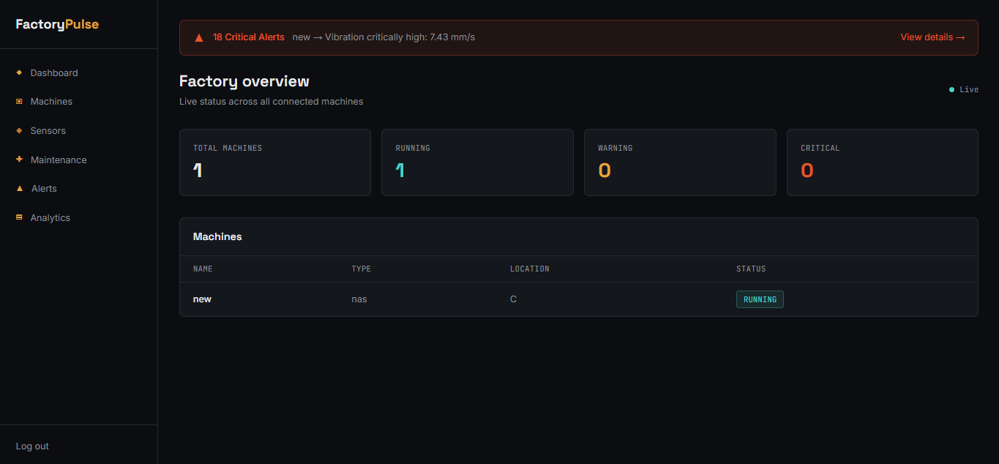

# FactoryPulse 🏭

Full-stack industrial machine monitoring and predictive maintenance platform built with **Vue 3**, **Go**, and **PostgreSQL**. Tracks real-time machine telemetry over WebSockets, automates alert generation, and manages maintenance workflows across a factory floor.

## Features

- **Authentication & RBAC** — JWT-based auth with role-based access control (Admin, Engineer, Technician, Production Manager); UI adapts based on the logged-in user's permissions
- **Machine management** — CRUD operations for factory equipment
- **Real-time telemetry** — Live sensor data (temperature, vibration, pressure) pushed to the client over **WebSockets** (no polling), with a Go-based simulator for demo purposes
- **Automated alerting** — Rule-based threshold detection that flags machines as `WARNING` or `CRITICAL`, with an alerts inbox supporting filtering (active/resolved) and manual resolution
- **Maintenance workflow** — Kanban-style job tracking (`OPEN` → `ASSIGNED` → `IN_PROGRESS` → `COMPLETED`)
- **Analytics** — MTBF/MTTR calculations and alert-frequency reporting via raw SQL aggregation (`JOIN`, `GROUP BY`, `EXTRACT(EPOCH ...)`)
- **Dockerized** — Full stack (backend, frontend, database) runs with a single `docker compose up`

## Tech stack

| Layer | Technology |
|---|---|
| Frontend | Vue 3, TypeScript, Pinia, Vue Router, Tailwind CSS, Chart.js |
| Backend | Go, Gin, JWT, bcrypt, Gorilla WebSocket |
| Database | PostgreSQL |
| DevOps | Docker, Docker Compose |

## Architecture


Backend follows a layered structure per domain (`handler` → `service` → `model`), organized under Go's `internal/` package convention to keep HTTP concerns separate from business logic and data access.

## Screenshots




## Running locally

```bash
git clone https://github.com/your-username/factorypulse.git
cd factorypulse
docker compose up --build
```

Visit `http://localhost:5173`.

To seed live sensor data, run the simulator separately (targets `machine_id: 1` by default):

```bash
cd backend
go run cmd/simulator/main.go
```

## Core workflow